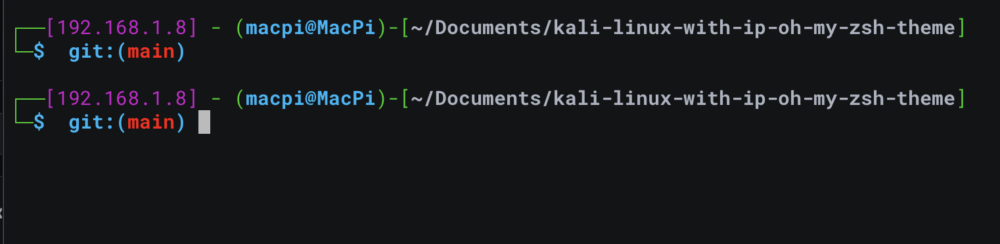

# MACOS kali-linux-with-ip-oh-my-zsh-theme
## this is a modified robbyrussell oh-my-zsh-theme for pentester and cybersec enthusiast for macos.

Use Powerline fonts such as roboto mono for powerline in iterm2. For those who are using default terminal app , you need to slightly modify the script, just add one spaces before the IP part and the $ part respectively.

